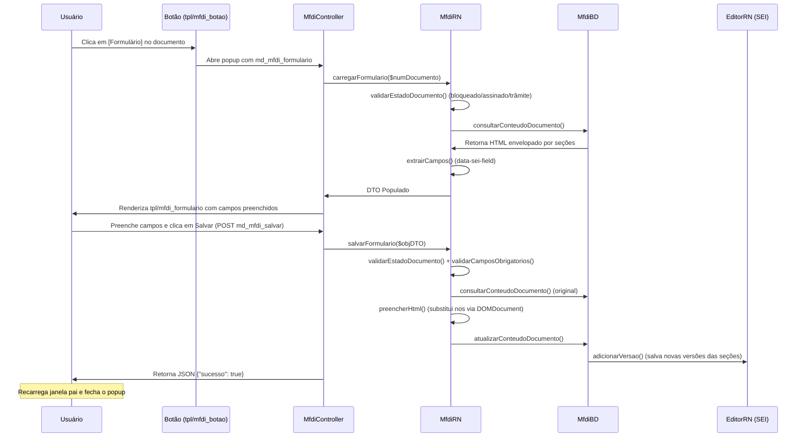

# Módulo MFDI — Formulários Dinâmicos Integrados (SEI v5.0)

O MVP do Módulo de Formulários Dinâmicos Integrados (MFDI) foi implementado no diretório `sei/web/modulos/mod-mfdi/` seguindo rigorosamente os padrões de desenvolvimento do manual oficial SEI 5.0 (Spec-Driven Development).

---

## 📂 Estrutura de Arquivos Criados

Os seguintes arquivos foram gerados dentro do diretório [mod-mfdi](/sei/web/modulos/mod-mfdi):

*   [MfdiDTO.php](/sei/web/modulos/mod-mfdi/MfdiDTO.php): Objeto de transporte de dados transiente (sem tabela física de banco).
*   [MfdiBD.php](/sei/web/modulos/mod-mfdi/MfdiBD.php): Camada de dados responsável por interagir com o SEI usando `VersaoSecaoDocumentoRN` (leitura) e `EditorRN` (escrita/geração de novas versões).
*   [MfdiRN.php](/sei/web/modulos/mod-mfdi/MfdiRN.php): Camada de negócio responsável pelas validações de estado do documento, regras de obrigatoriedade e preenchimento via `DOMDocument`/`DOMXPath`.
*   [MfdiINT.php](/sei/web/modulos/mod-mfdi/MfdiINT.php): Camada de integração (placeholder).
*   [MfdiController.php](/sei/web/modulos/mod-mfdi/MfdiController.php): Controlador das ações de visualização (`md_mfdi_formulario`) e salvamento via AJAX (`md_mfdi_salvar`).
*   [MfdiIntegracao.php](/sei/web/modulos/mod-mfdi/MfdiIntegracao.php): Classe principal do módulo herdando de `SeiIntegracao`, contendo as configurações de recurso e a injeção do botão de ação.
*   [md_mfdi_instalar.php](/sei/web/modulos/mod-mfdi/md_mfdi_instalar.php): Script idempotente de instalação do módulo, registrando o recurso `md_mfdi_formulario` no SIP e associando-o ao perfil Administrador.
*   **Interface (Templates):**
    *   [tpl/mfdi_botao.php](/sei/web/modulos/mod-mfdi/tpl/mfdi_botao.php): Template HTML para renderizar o botão de ação na barra superior de documentos.
    *   [tpl/mfdi_formulario.php](/sei/web/modulos/mod-mfdi/tpl/mfdi_formulario.php): Formulário dinâmico gerado com base em inputs e tipos suportados (texto, numero, moeda, data, boolean, lista, textarea) e classes CSS padrão do SEI.
*   **Imagens:**
    *   [imagens/botao_mfdi.svg](/sei/web/modulos/mod-mfdi/imagens/botao_mfdi.svg): Ícone oficial do botão no formato SVG (40x40) em conformidade com o padrão visual do SEI.

---

## ⚡ Fluxo de Funcionamento



---

## 🚀 Como Ativar o Módulo no Ambiente

1.  **Registrar a Classe de Integração:**
    Adicione o módulo na chave `'Modulos'` do array `'SEI'` dentro do arquivo `config/ConfiguracaoSEI.php`:
    ```php
    'SEI' => array(
        // ...
        'Modulos' => array(
            // ...
            'MfdiIntegracao' => 'mod-mfdi'
        )
    )
    ```

2.  **Executar o Script de Instalação (registro de recursos no SIP):**
    Execute o script a partir do terminal para cadastrar a permissão `md_mfdi_formulario` no banco de dados SIP e associá-la automaticamente ao perfil Administrador:
    ```bash
    php sei/web/modulos/mod-mfdi/md_mfdi_instalar.php
    ```

3.  **Marcar Documentos no Editor HTML do SEI:**
    Os documentos do SEI devem conter elementos HTML anotados com `data-sei-*` para que o módulo identifique e gere os campos automaticamente. Exemplo:
    ```html
    <table>
        <tr>
            <td>Nome do Cliente:</td>
            <td data-sei-field="nome_cliente" data-sei-label="Nome do Cliente" data-sei-type="texto" data-sei-required="true">
                Valor Inicial
            </td>
        </tr>
        <tr>
            <td>Valor do Contrato:</td>
            <td data-sei-field="valor_contrato" data-sei-label="Valor do Contrato" data-sei-type="moeda" data-sei-required="true">
                0,00
            </td>
        </tr>
    </table>
    ```
