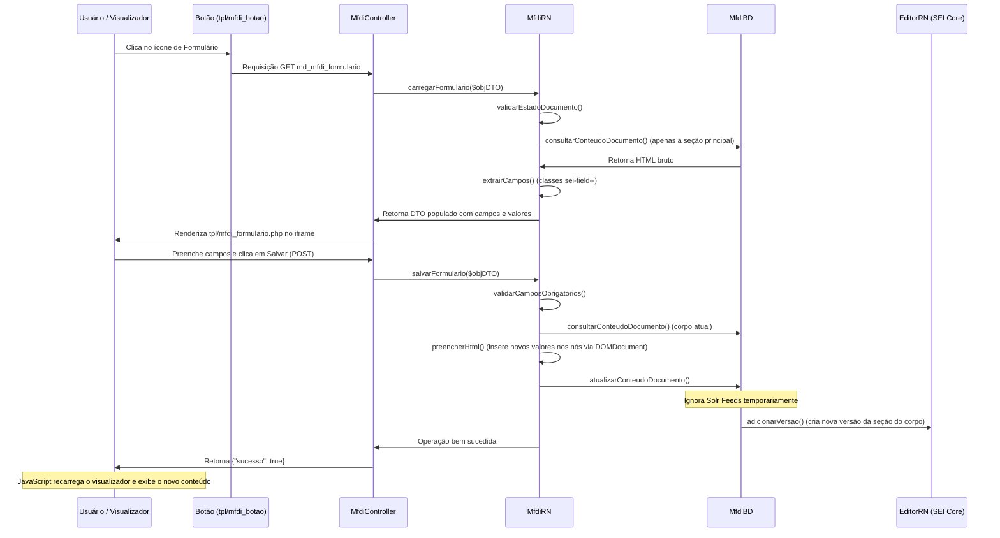

# Módulo MFDI — Formulários Dinâmicos Integrados (SEI v5.0)

O MVP do Módulo de Formulários Dinâmicos Integrados (MFDI) foi implementado no diretório `sei/web/modulos/mod-mfdi/` seguindo as diretrizes oficiais do SEI 5.0.

---

## 📂 Estrutura de Arquivos

Os arquivos estão organizados da seguinte forma dentro de [mod-mfdi](file:///C:/Sistemas/seiMGI/fontes/sei/web/modulos/mod-mfdi):

*   [MfdiDTO.php](file:///C:/Sistemas/seiMGI/fontes/sei/web/modulos/mod-mfdi/MfdiDTO.php): DTO transiente (sem tabela física no banco) para transporte dos dados dos formulários.
*   [MfdiBD.php](file:///C:/Sistemas/seiMGI/fontes/sei/web/modulos/mod-mfdi/MfdiBD.php): Camada de persistência. Consulta a versão ativa da seção principal do documento e atualiza-a criando uma nova versão via `EditorRN` (preservando cabeçalho e rodapé).
*   [MfdiRN.php](file:///C:/Sistemas/seiMGI/fontes/sei/web/modulos/mod-mfdi/MfdiRN.php): Regras de Negócio. Valida o estado do documento (bloqueado, assinado, encerrado), valida campos obrigatórios, remove espaços não-separáveis (`&nbsp;`) e faz o parse/preenchimento do HTML usando `DOMDocument`/`DOMXPath`.
*   [MfdiINT.php](file:///C:/Sistemas/seiMGI/fontes/sei/web/modulos/mod-mfdi/MfdiINT.php): Camada de integração (placeholder).
*   [MfdiController.php](file:///C:/Sistemas/seiMGI/fontes/sei/web/modulos/mod-mfdi/MfdiController.php): Controlador unificado. Trata o fluxo GET (carregar formulário) e POST (gravação assíncrona via AJAX), interceptando exceções para respostas em JSON amigáveis ao cliente.
*   [MfdiIntegracao.php](file:///C:/Sistemas/seiMGI/fontes/sei/web/modulos/mod-mfdi/MfdiIntegracao.php): Injeta o botão de preenchimento na barra de comandos superior do visualizador de documentos do SEI.
*   [md_mfdi_instalar.php](file:///C:/Sistemas/seiMGI/fontes/sei/web/modulos/mod-mfdi/md_mfdi_instalar.php): Script CLI idempotente para registrar o recurso `md_mfdi_formulario` no banco de dados SIP e associá-la ao perfil Administrador.
*   **Interface (Templates):**
    *   [tpl/mfdi_botao.php](file:///C:/Sistemas/seiMGI/fontes/sei/web/modulos/mod-mfdi/tpl/mfdi_botao.php): Renderiza o ícone de ação na barra superior.
    *   [tpl/mfdi_formulario.php](file:///C:/Sistemas/seiMGI/fontes/sei/web/modulos/mod-mfdi/tpl/mfdi_formulario.php): Formulário dinâmico renderizado dentro do iframe, com validações JS e envio AJAX com tratamento de erros.
*   **Imagens:**
    *   [imagens/botao_mfdi.svg](file:///C:/Sistemas/seiMGI/fontes/sei/web/modulos/mod-mfdi/imagens/botao_mfdi.svg): Ícone oficial do botão (SVG 40x40).

---

## ⚡ Fluxo de Funcionamento



---

## 🚀 Como Ativar e Usar o Módulo

1.  **Registrar a Classe de Integração:**
    Adicione a classe de integração no arquivo `config/ConfiguracaoSEI.php`:
    ```php
    'SEI' => array(
        // ...
        'Modulos' => array(
            // ...
            'MfdiIntegracao' => 'mod-mfdi'
        )
    )
    ```

2.  **Executar o Script de Instalação (SIP):**
    Execute via CLI para cadastrar o recurso:
    ```bash
    php C:\Sistemas\seiMGI\fontes\sei\web\modulos\mod-mfdi\md_mfdi_instalar.php
    ```

3.  **Bypass de Solr Feed:**
    O salvamento de versões ignora de forma segura e automática o indexador do Solr (`FeedSEIProtocolos`) para evitar falhas em ambientes de desenvolvimento onde o Solr não está configurado.

---

## 👑 Marcação de Campos no Editor HTML do SEI

Os campos dinâmicos devem ser anotados no Editor HTML do SEI usando **classes CSS especiais** (em vez de atributos customizados `data-*`, que costumam ser removidos pelo filtro XSS do CKEditor).

### Classes Suportadas:
*   `sei-field--{nome_do_campo}`: Associa o elemento ao nome do campo no formulário.
*   `sei-type--{tipo}`: Define o componente de input. Tipos suportados:
    *   `texto`: Campo texto comum.
    *   `numero`: Campo do tipo número.
    *   `moeda`: Campo com máscara monetária (formato brasileiro `1.000,00`).
    *   `data`: Input do tipo calendário.
    *   `boolean`: Dropdown do tipo "Sim/Não" (`value="Sim"` ou `value="Não"`).
    *   `textarea`: Campo de área de texto grande.
    *   `lista`: Componente select dropdown. Requer a especificação de opções.
*   `sei-required`: Torna o preenchimento do campo obrigatório tanto no front-end quanto no back-end.
*   `sei-options--{base64url_options}`: Define as opções para campos do tipo `lista`. A string deve ser codificada em **base64url** contendo opções separadas por `|` ou `,` (ex: `Presencial|Remoto|Hibrido` vira `UHJlc2VuY2lhbHxSZW1vdG98SGlicmlkbw`).

### Exemplo de Template HTML para o Editor:
```html
<table class="table infraTable" style="border-collapse: collapse; border-color: #ccc; width: 100%; border: 1px solid #ccc;">
  <thead>
    <tr style="background-color: #f2f2f2;">
      <th colspan="2" style="padding: 8px;">Dados do Contrato</th>
    </tr>
  </thead>
  <tbody>
    <!-- Campo Texto Obrigatório -->
    <tr>
      <td style="width: 30%; padding: 8px;">Razão Social: *</td>
      <td class="sei-field--razao_social sei-type--texto sei-required" style="padding: 8px;">&nbsp;</td>
    </tr>
    <!-- Campo Moeda -->
    <tr>
      <td style="padding: 8px;">Valor Estimado:</td>
      <td class="sei-field--valor_mensal sei-type--moeda" style="padding: 8px;">0,00</td>
    </tr>
    <!-- Campo Dropdown com Opções (Base64url para 'Presencial|Remoto|Hibrido') -->
    <tr>
      <td style="padding: 8px;">Regime de Execução:</td>
      <td class="sei-field--regime_execucao sei-type--lista sei-options--UHJlc2VuY2lhbHxSZW1vdG98SGlicmlkbw" style="padding: 8px;">&nbsp;</td>
    </tr>
    <!-- Campo Textarea -->
    <tr>
      <td style="padding: 8px;">Justificativa: *</td>
      <td class="sei-field--justificativa sei-type--textarea sei-required" style="padding: 8px;">&nbsp;</td>
    </tr>
  </tbody>
</table>
```
